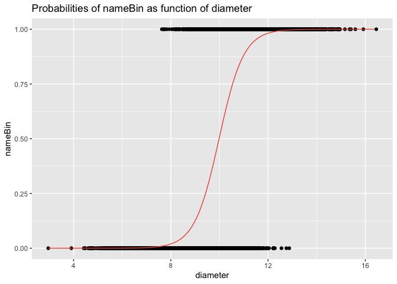
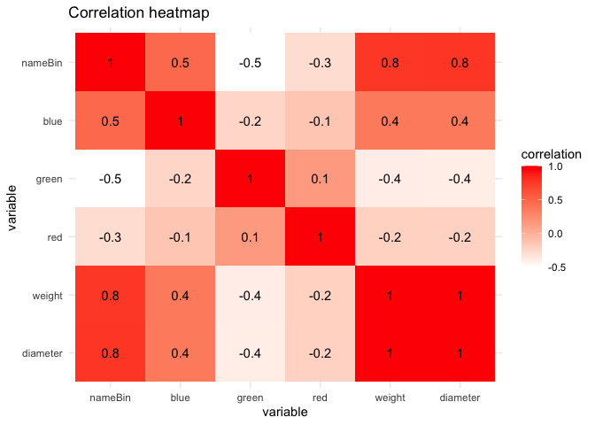

<!-- README.md is generated from README.Rmd. Please edit that file -->

# projektROR

<!-- badges: start -->
<!-- badges: end -->

The goal of projektROR is to provide all necessary tools for logistic
regression.

Our package supplies method for creating logistic regresion model. It
consists of all needed methods to help visualise dependencies between
variables. Let us compare two models with each other. Also with use of
AIC and BIC, for small data tables (a few variables), we can compare all
possible models. Our package also supplies method for K-Fold Cross
Validation. Using this package you can plot ROC curve and compute AUC,
too. One of its features is also possibility to compute and plot
predicted probabilities based on created model.

## Installation

You can install the development version of projektROR from
[GitHub](https://github.com/) with:

``` r
# install.packages("devtools")
devtools::install_github("ZuzannaNogala/projektROR", build_vignettes = TRUE)
```

## Example

We can start with creating model.

``` r
library(projektROR)
model <- logisMod(nameBin ~ diameter, data = citrus)
```

But not all of the methods require creating models beforehand. Now,
because its consits of one independent variable, we can create plot of
predictions.

``` r
projektROR:::resPlot(model)
```



One of the most colorful features is correlation heatmap. It shows
pearson correlation coefficient as color intensity.

``` r
vars <- c("diameter", "weight", "red", "green", "blue", "nameBin")
corrHeatmap(citrus, vars)
```



Usage of remaining methods you can find in exemplary data analisys
included into package.

If you want learn more about package and see how another methods works
look at our html vignette.

``` r
browseVignettes("projektROR")
```
